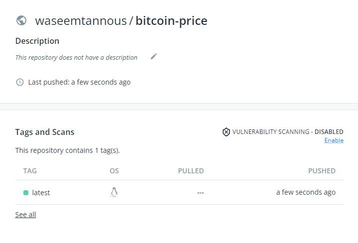

# Bitcoin Price

I have built a simple web application that will show the current price of Bitcoin in USD and the price in the last 10 minutes.

Used Flask to build the API and Docker to dockerize the application. Used Redis to store the data.

## Running the application

To run the application, run the following commands:

```sh
git clone https://github.com/waseemtannous/BitcoinPrice.git
cd BitcoinPrice
docker-compose up -d
```

Call the API from your browser or using curl at http://localhost:5000/

Response will be in JSON format:

```json
{
  "currentPrice": 20234,
  "avgPrice": 20215.167999999998
}
```

To stop the application, run:

```sh
docker-compose down
```

## Jenkins Pipeline

Used Jenkins to build and publish the application to Docker Hub.

First, I installed Jenkins on an AWS EC2 instance and installed docker.

Also, created a token from Docker to push the image to Docker Hub and set the token in the Jenkins credentials.



After that, Jenkins will notify when the build and push is done using Slack.

## Kubenetes

```sh
cd BitcoinPrice
minikube start
kubectl create -f pod.yaml
```

## Kubernetes (minikube)

To deploy the application locally to minikube, run the following commands:

```sh
git clone https://github.com/waseemtannous/BitcoinPrice.git
minikube start
kubectl apply -f k8sDeployment.yaml
minikube tunnel
```

Now you can access the application at http://localhost:5000/

To stop deployment, run:

```sh
minikube delete
```
